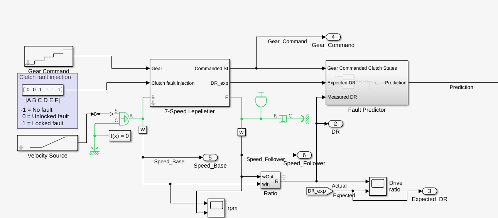

# PredM
Predictive Maintenance

We integrated [SUMO](https://www.eclipse.org/sumo/) & Simulink & [OMNeT++](https://omnetpp.org/) to simulate the vehicle engine fault and factory machine engine fault.

### SUMO map

We use [open street map](https://sumo.dlr.de/docs/Tutorials/OSMWebWizard.html) to generate Singapore map and use the satellite background. The traffic duration is 86400 seconds(24 hours). We use the car-only network and didn't import any pedestrians.

The traffic density:

| type   | Through Traffic Factor | Count |
| ------ | ---------------------- | ----- |
| Cars   | 2                      | 2     |
| Trucks | 1                      | 1     |
| Bus    | 1                      | 1     |

There are 4 factories on the map: 

| no.       | location              |
| --------- | --------------------- |
| Factory 0 | Dairy Farm Walk       |
| Factory 1 | Defu South Street 1   |
| Factory 2 | Pasir Panjang Drive 3 |
| Factory 3 | Marina E Dr           |

### Simulink model

Because the vehicles' engine are too complicated, we only simulate Lepelletier Gear Set. We use the example model from Simulink which can be found at [Transmission Fault Detection Harness](https://www.mathworks.com/help/sdl/ug/transmission-fault-detection.html). There are 6 clutches which may get stuck or slip. We use the MDP model to represent the engine state transitions, the state will change every 480 seconds (8 minutes)

Each MDP state corresponding to a clutch fault state:

| MDP  | A              | B              | C              | D              | E              | F              | array                    |
| ---- | -------------- | -------------- | -------------- | -------------- | -------------- | -------------- | ------------------------ |
| 0    | No fault       | No fault       | No fault       | No fault       | No fault       | No fault       | [-1, -1, -1, -1, -1, -1] |
| 1    | Locked fault   | No fault       | No fault       | No fault       | No fault       | No fault       | [1, -1, -1, -1, -1, -1]  |
| 2    | No fault       | Locked fault   | Locked fault   | No fault       | No fault       | No fault       | [-1, 1, 1, -1, -1, -1]   |
| 3    | No fault       | No fault       | No fault       | Locked fault   | Locked fault   | Unlocked fault | [-1, -1, -1, 1, 1, 0]    |
| 4    | Unlocked fault | Unlocked fault | No fault       | No fault       | Locked fault   | Locked fault   | [0, 0, -1, -1, 1, 1]     |
| 5    | Unlocked fault | Unlocked fault | Unlocked fault | Unlocked fault | Unlocked fault | Unlocked fault | [0, 0, 0, 0, 0, 0]       |

### Testbed

4 factories, 12 lorries

|          | # Goods / week                                               |
| -------- | ------------------------------------------------------------ |
| Baseline | No maintenance (breakdown: 1 day to repair)                  |
| Daily    | 4 hours everyday  (back to state 0), breakdown: 1 day to repair |
| PARL     | 4 hours (back to state 0), breakdown: 1 day to repair        |

| parameter                         | values                         |
| --------------------------------- | ------------------------------ |
| no. lorry                         | 12                             |
| $E(\textrm{random failure})$      | $120$ hours                    |
| $E(\textrm{degradation failure})$ | $24$ hours                     |
| Factory 0                         | P1                             |
| Factory 1                         | P2, P12 (P1 & P2)              |
| Factory 2                         | P3, P23 (P2 & P3), A(P12 & P3) |
| Factory 3                         | P4, B(P23 & P4)                |
| distance between factories        | 2.5 km ~ 3 km                  |
| max speed                         | 16.67 m/s (60 kph)             |

### Lorry management

Condition (Observation space):

1. Product storage,
2. Factory state, i.e., materials storage
3. Lorry density, i.e .,# lorries in each factory
4. Lorry position, i.e., distance between current position to the destination
5. Lorry current state.

#### Step 1: Calculate the score for each factory. The greater the score, the more lorries are required.

* Assume a product $P1$ is produced in $Factory\,A$  and will be consumed at $Factory\,B$

  $m_i=min\{m_{AP1},3*lorry\, capacity\} - (m_{BP1}+m_{lorry\_P1})$

  $S1[i]=p_i*m_i$

  In terms of $Factory\,1$:

  $m_{1_1}=min\{m_{BP2}-m_{BP1},3*lorry\, capacity\}-(m_{CP2}+m_{lorry\_P2})$

  $m_{1_2}=min\{m_{BP12},3*lorry\, capacity\}-(m_{CP12}+m_{lorry\_P12})$

  $S1[1]=p_1*m_{1_1}+p_2*m_{1_2}$

* Score of lorry density

  $S_2=-n_{lorry}*p_{n+1}$

* Sum up the scores

  $S =S_1+S_2$

**Remark**:

1. Design $p$ properly, only when $S>0$, the factory need new lorry.
2. Lorry pool: when $n^{'}=n_{lorry}-1$, $S$ is still a positive value.
