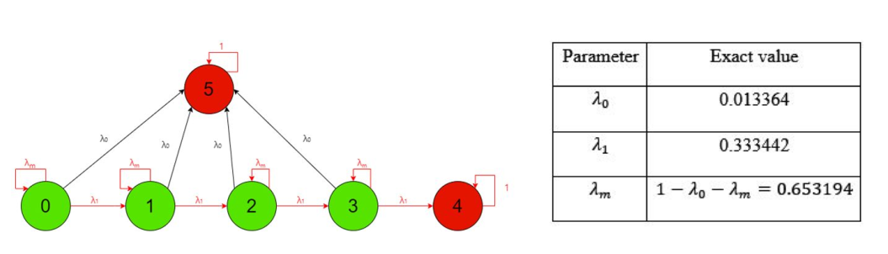

# PredM
Predictive Maintenance

We integrated [SUMO](https://www.eclipse.org/sumo/) & Simulink & [OMNeT++](https://omnetpp.org/) to simulate the vehicle engine fault and factory machine engine fault.

### SUMO map

We use [open street map](https://sumo.dlr.de/docs/Tutorials/OSMWebWizard.html) to generate Singapore map and use the satellite background. The traffic duration is 86400 seconds(24 hours). We use the car-only network and didn't import any pedestrians.

The traffic density:

| type   | Through Traffic Factor | Count |
| ------ | ---------------------- | ----- |
| Cars   | 2                      | 2     |
| Trucks | 1                      | 1     |
| Bus    | 1                      | 1     |

There are 4 factories on the map: 

| no.       | location              |
| --------- | --------------------- |
| Factory 0 | Dairy Farm Walk       |
| Factory 1 | Defu South Street 1   |
| Factory 2 | Pasir Panjang Drive 3 |
| Factory 3 | Marina E Dr           |

### Simulink model

Because the vehicles' engine are too complicated, we only simulate Lepelletier Gear Set. We use the example model from Simulink which can be found at [Transmission Fault Detection Harness](https://www.mathworks.com/help/sdl/ug/transmission-fault-detection.html). There are 6 clutches which may get stuck or slip. We use the MDP model to represent the engine state transitions, the state will change every 480 seconds (8 minutes)

Each MDP state corresponding to a clutch fault state:

| MDP  | A              | B              | C              | D              | E              | F              | array                    |
| ---- | -------------- | -------------- | -------------- | -------------- | -------------- | -------------- | ------------------------ |
| 0    | No fault       | No fault       | No fault       | No fault       | No fault       | No fault       | [-1, -1, -1, -1, -1, -1] |
| 1    | Locked fault   | No fault       | No fault       | No fault       | No fault       | No fault       | [1, -1, -1, -1, -1, -1]  |
| 2    | No fault       | Locked fault   | Locked fault   | No fault       | No fault       | No fault       | [-1, 1, 1, -1, -1, -1]   |
| 3    | No fault       | No fault       | No fault       | Locked fault   | Locked fault   | Unlocked fault | [-1, -1, -1, 1, 1, 0]    |
| 4    | Unlocked fault | Unlocked fault | No fault       | No fault       | Locked fault   | Locked fault   | [0, 0, -1, -1, 1, 1]     |
| 5    | Unlocked fault | Unlocked fault | Unlocked fault | Unlocked fault | Unlocked fault | Unlocked fault | [0, 0, 0, 0, 0, 0]       |

### Testbed

4 factories, 8 lorries

|          | # Goods / week                                               |
| -------- | ------------------------------------------------------------ |
| Baseline | No maintenance (breakdown: 1 day to repair)                  |
| Daily    | 4 hours everyday  (back to state 0), breakdown: 1 day to repair |
| PARL     | 4 hours (back to state 0), breakdown: 1 day to repair        |

### Lorry management

Condition (Observation space):

1. Product storage,
2. Factory state, i.e., materials storage
3. Lorry density, i.e .,# lorries in each factory
4. Lorry position, i.e., distance between current position to the destination
5. Lorry current state.

#### Step 1: Calculate the score for each factory. The greater the score, the more lorries are required.

* Score of current product storage

  $S_1=p_0*min\{m_p,lorry\_capacity\}$

* Score of materials storage

  $S_2=(min\{ms,p_5\}-rate*ratio*E[t]-m_{current})*p_1$

* Score of lorry density

  $S_3=-n_{lorry}*p_2$

* Sum up the scores

  $S =S_1+S_2+S_3 $

**Remark**:

1. The material of one product is the product produced in other factories. So, $S_2$ should get from other factories.
2. Design $p_2$ properly, only when $S>0$, the factory need new lorry.
3. Lorry pool: when $n^{'}=n_{lorry}-1$, $S$ is still a positive value.

#### Step 2: Assign the lorry 

* Normalise the distance or times a constant

  $C_1=-d*p_3$

* Only select 'waiting' or 'loading' lorry

  $C_2=\left\{\begin{array}{11}1&\textrm{status is waiting}\\p_4*loaded\quad weight&\textrm{status is loading}\\0&\textrm{o.w}\end{array}\right.$, **Remark:** $p_5*loaded\quad weight<1$

* Calculate the score of each lorry, select the lorry with highest score.

  $C=C_1*C_2$

**Remark:** The score should be recalculated whenever a new lorry arrives or departs.

factory 4 no need lorry
